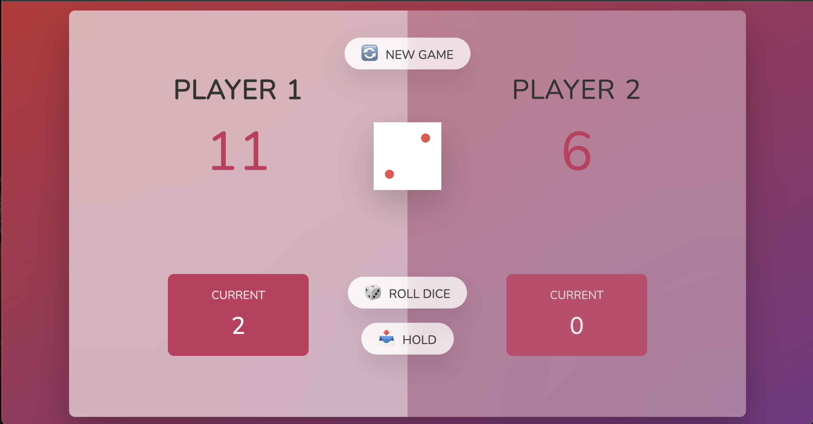

# Pig Game 🐷🎲

¡Bienvenido al **Pig Game**!  
Un divertido juego de dados para dos jugadores donde la suerte y la estrategia se combinan.  
¡Compite para ver quién llega primero a la meta y demuestra que eres el mejor!

[](https://developer.mozilla.org/es/docs/Web/JavaScript)
[](https://developer.mozilla.org/es/docs/Web/HTML/HTML5)
[](https://developer.mozilla.org/es/docs/Web/CSS)

---

## 📚 Tabla de Contenidos

- [Descripción](#descripción-)
- [Características](#características-)
- [Demo](#demo-)
- [Instalación](#instalación-)
- [Uso](#uso-)
- [Tecnologías](#tecnologías-)
- [Contribución](#contribución-)
- [Licencia](#licencia-)
- [Contacto](#contacto-)

---

## Descripción 📖

**Pig Game** es un juego interactivo para dos jugadores desarrollado con **HTML**, **CSS** y **JavaScript (ES6)**.  
En este juego, cada jugador lanza un dado y acumula puntos.  
El objetivo es **alcanzar la puntuación ganadora** (en este ejemplo, 20 puntos) sin arriesgar demasiado:  
Si sacas un **1**, pierdes los puntos acumulados en ese turno y el turno pasa al siguiente jugador. ¡La estrategia es clave! 🔥

---

## Características 💡

- **Fácil de jugar:** Interfaz sencilla e intuitiva para una experiencia fluida.  
- **Animaciones y transiciones:** Cambios visuales para indicar el turno, resultados del dado y el ganador.  
- **Juego competitivo:** Usa el botón **"Roll dice"** para arriesgar o **"Hold"** para guardar tus puntos y pasar el turno.  
- **Reinicio instantáneo:** Con **"New game"** puedes empezar de cero en cualquier momento.  
- **Responsive y atractivo:** Diseño moderno con efectos de luz y sombras que le dan un toque especial.

---

## Demo 🎥

¡Mira el juego en acción!  
  

---

## Instalación ⚙️

Para disfrutar del **Pig Game** en tu equipo, sigue estos pasos:

1. **Clona el repositorio:**

    ```bash
    git clone https://github.com/tu-usuario/pig-game.git
    ```

2. **Accede al directorio del proyecto:**

    ```bash
    cd pig-game
    ```

3. **Abre el archivo `index.html` en tu navegador:**

    - Haz doble clic sobre el archivo.
    - O, en la terminal, ejecuta:
    
      ```bash
      open index.html
      ```
      *(En Windows, haz doble clic o usa `start index.html` en la terminal)*

---

## Uso 🚀

1. **Inicia el juego:** Se muestran los puntajes iniciales y los botones.
2. **Lanza el dado:** Haz clic en **"🎲 Roll dice"** para lanzar el dado.  
   - Si obtienes un número diferente de 1, se sumará a tu puntaje actual.
   - Si sacas un **1**, perderás los puntos acumulados en ese turno y se cambiará el turno.
3. **Guarda tus puntos:** Pulsa **"📥 Hold"** para añadir tus puntos acumulados a tu puntuación total y ceder el turno.
4. **Reinicia el juego:** Usa el botón **"🔄 New game"** para empezar una partida nueva en cualquier momento.

---

## Tecnologías 💻

Este proyecto se construyó con:

- **HTML5** para la estructura del juego.  
- **CSS3** para el estilo, animaciones y efectos visuales.  
- **JavaScript (ES6)** para la lógica y la interactividad del juego.

---

## Contribución 🤝

¡Tus contribuciones son muy bienvenidas! Si deseas mejorar el juego o agregar nuevas funciones, sigue estos pasos:

1. **Haz un fork** del repositorio. 🍴
2. **Crea una rama** para tu nueva característica:

    ```bash
    git checkout -b feature/nueva-caracteristica
    ```

3. Realiza tus cambios y **haz commit**:

    ```bash
    git commit -m "Agrega nueva característica"
    ```

4. **Envía un pull request** para que se revisen tus cambios. 🚀

---

## Licencia 📜

Este proyecto se distribuye bajo la licencia [MIT](LICENSE). 🔓

---

## Contacto 📞

Si tienes alguna pregunta, sugerencia o comentario, ¡no dudes en contactarme!

- **Nombre:** Javier González Giménez  
- **GitHub:** [gonzgimnzjavier](https://github.com/gonzgimnzjavier)  
- **Email:** [javiergonzalezgimenez2003@gmail.com](mailto:javiergonzalezgimenez2003@gmail.com)

---

¡Diviértete jugando y demuestra tu habilidad en el **Pig Game**! 🐷🎲
